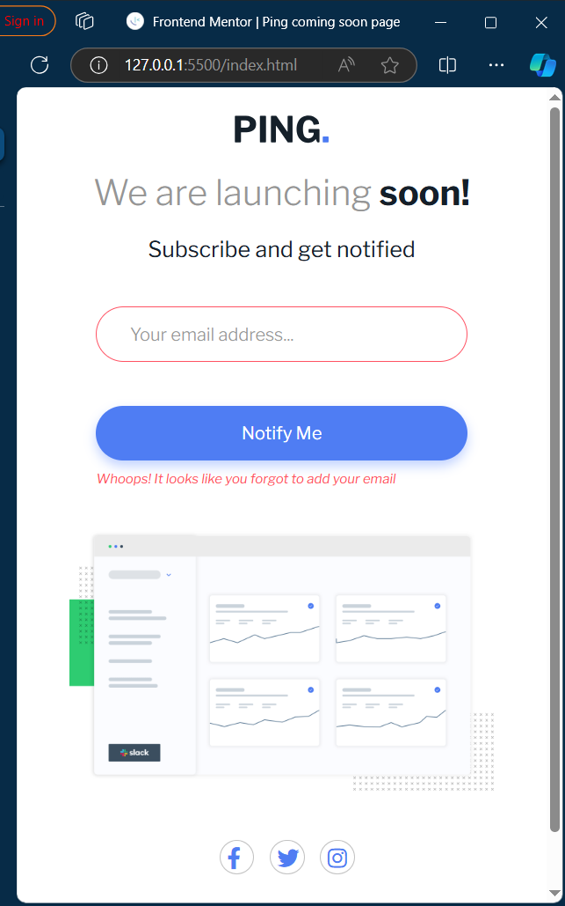

# Frontend Mentor - Ping coming soon page solution

This is a solution to the [Ping coming soon page challenge on Frontend Mentor](https://www.frontendmentor.io/challenges/ping-single-column-coming-soon-page-5cadd051fec04111f7b848da). Frontend Mentor challenges help you improve your coding skills by building realistic projects. 

## Table of contents

- [Overview](#overview)
  - [The challenge](#the-challenge)
  - [Screenshot](#screenshot)
  - [Links](#links)
- [My process](#my-process)
  - [Built with](#built-with)
  - [What I learned](#what-i-learned)
  - [Continued development](#continued-development)
  - [Useful resources](#useful-resources)
- [Author](#author)


## Overview

### The challenge

Users should be able to:

- View the optimal layout for the site depending on their device's screen size
- See hover states for all interactive elements on the page
- Submit their email address using an `input` field
- Receive an error message when the `form` is submitted if:
	- The `input` field is empty. The message for this error should say *"Whoops! It looks like you forgot to add your email"*
	- The email address is not formatted correctly (i.e. a correct email address should have this structure: `name@host.tld`). The message for this error should say *"Please provide a valid email address"*

### Screenshot



### Links

- Solution URL: (https://github.com/carmela925/ping-coming-soon-page-master)
- Live Site URL: (https://main--ping-coming-soon-carmela925.netlify.app/)

## My process

### Built with

- Semantic HTML5 markup
- CSS custom properties
- Flexbox
- Icons (https://cdnjs.cloudflare.com/ajax/libs/font-awesome/6.0.0-beta3/css/all.min.css) 

### What I learned

I learned about regular expressions inorder to check the correct format of an email. I also learned about media queries to vary the design according to the device screen

Some important code I added:

```css
	@media only screen and (max-width: 592px) {
	  main {
		  margin: 5px 0;
	  }
	  .logo {
		  margin: 20px;
	  }
	  h1 {
		  font-size: 32px;
	  }
	  h1 span {
		  font-size: 32px;
	  }
	  form {
		  width: 70%;
		  flex-direction: column;
		  gap: 10px;
	  }
	  input, button {
		  width: 100%;
		  font-size: 16px;
	  }
	  .dashboard {
		  width: 80%;
		  margin: 40px 0;
	  }
	  .socials a {
		  width: 30px;
		  height: 30px;
	  }
	  #error {
		  width: 70%;
		  font-size: 12px;
	  }
	  .custom-alert {
		  padding: 15px;
	  }
  }
```
```js
var form = document.getElementById("form");
	form.addEventListener("submit", ()=>{
	  event.preventDefault();
	  const input = document.getElementById("inpt");
	  const message = document.getElementById("error");
	  const format = /^[^@\s]+@[^@\s]+\.[^@\s\.]+$/;
	  if(input.value==""){
		input.style.border = "1px solid hsl(354, 100%, 66%)";
		message.textContent = "Whoops! It looks like you forgot to add your email"
		message.style.display = "block";
	  }else
	  if(format.test(input.value)){
		input.style.border = "1px solid hsl(223, 100%, 88%)";
		message.style.display = "none";
		showAlert();
	  } else {
		input.style.border = "1px solid hsl(354, 100%, 66%)";
		message.style.display = "block";
	  }
	});
```


### Continued development

I have to learn more about responsive coding.


### Useful resources

- [resource 1](https://developer.mozilla.org/en-US/docs/Web/CSS/CSS_media_queries/Using_media_queries_for_accessibility) - This helped me for learning about media queries
- [resource 2](https://developer.mozilla.org/en-US/docs/Web/JavaScript/Guide/Regular_expressions) - This is an amazing article which helped me finally understand Regular expressions. I'd recommend it to anyone still learning this concept.

## Author

- Website - (https://github.com/carmela925/)
- Frontend Mentor - (https://www.frontendmentor.io/profile/carmela925)
